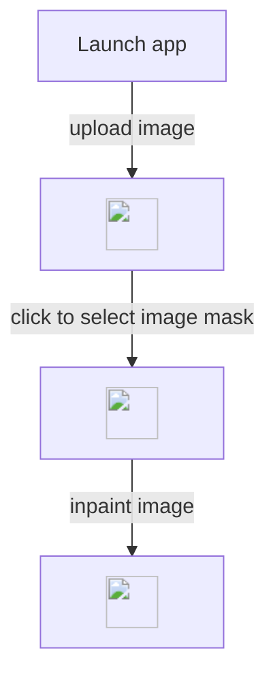

# Selective Editor

## How to use 

```
pip install git+https://github.com/facebookresearch/sam2.git
pip install git+https://github.com/not-lain/selective-editor.git
```

```python
from selective_editor import get_app

app = get_app()
app.launch()
```

## Example

