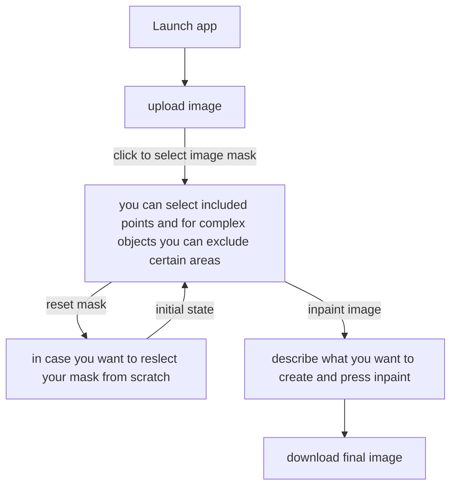

# Selective Editor

## How to use 

```
pip install git+https://github.com/facebookresearch/sam2.git
pip install git+https://github.com/not-lain/selective-editor.git
```

```python
from selective_editor import get_app

app = get_app()
app.launch()
```

## Pipeline



## Example

<p align="center">
    <div style="display: flex; justify-content: center; align-items: center; gap: 10px;">
        
        
        
    </div>
</p>

## Notebooks

| Description | Link |
| --- | --- |
| Notebook with pip integration | <a href="https://colab.research.google.com/github/not-lain/selective-editor/blob/main/notebooks/slective_editor_pip_notebook.ipynb" target="_parent"></a> <a href="https://youtu.be/t38OoY1Q3wg" target="_parent"></a> 
| Manually laid out script | <a href="https://colab.research.google.com/github/not-lain/selective-editor/blob/main/notebooks/selective_editor_manual_notebook.ipynb" target="_parent"></a> |